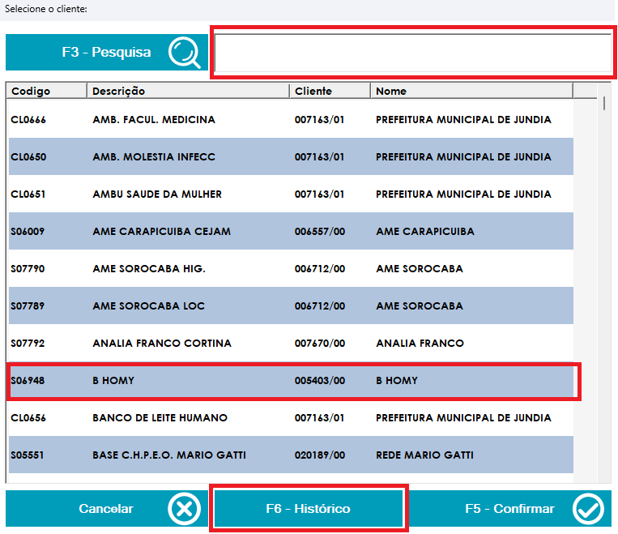
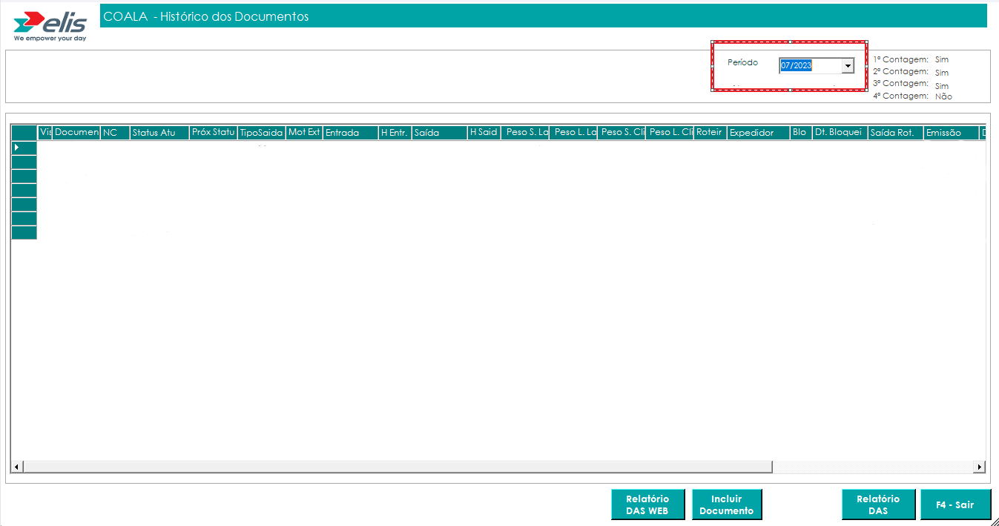

* Na aba de **Historico de Clientes**, podemos puxar todos os documentos lançados no mês do cliente escolhido

* Primeiramente você **pesquisa** o nome do cliente escolhido

* Segundamente você **seleciona** o cliente e **clique em historico**

* **Como no print abaixo**

* E dessa forma você tem acesso a todos os documentos lançados referente ao cliente, de acordo com o mês que selecionamos.

* *Podemos também escolher o mês ali na opção de **Período**.*

