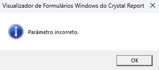

Ordem | Pergunta | Resultado | Descrição
----- | -------- | --------- | ---------
01    |Filial Hig: |07 |
02    |Contrato de: | |
03    |Contrato ate: |ZZZZZZ |
04    |Cliente de: | |
05    |Cliente ate: |ZZZZZZZZZZZ |
06    |Loja de: | |
07    |Loja ate: |ZZ |
08    |Produto de: | |
09    |Produto ate: |ZZZZZZZZZZZ |
10    |Sinalizar em? |50|
11    |Sinalizar MOPS em |150 |

