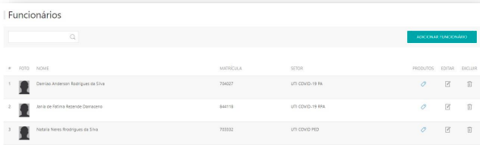

---
* Para fazer o cadastro de funcionários acesse o site pelo link, entre com o seu usuário e senha de cliente e clique em **ENTRAR**.

* Selecionar o cliente que deseja , clicar em **ACESSAR**.

Site: http://myelis.elisbrasil.com

---

* No menu principal clicar em **MEUS CADASTROS > FUNCIONÁRIOS;**

* Serão exibidas listagem dos funcionários que já estão cadastrados, para adicionar clicar em **ADICIONAR FUNCIONÁRIO**;

* Informar o número da matricula do funcionário. Clicar em **VERIFICAR**;

* Informar os dados solicitados na tela: Nome Completo, e-mail, matricula, crachá, telefone, setor, turno, perfil, situação e crachá temporário.

* Os campos que **são** obrigatórios: *Nome, Crachá, Setor, Situação*

***Atualizado em 28 de julho de 2023***