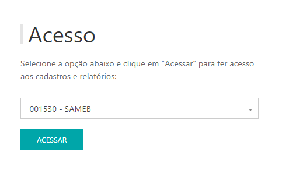
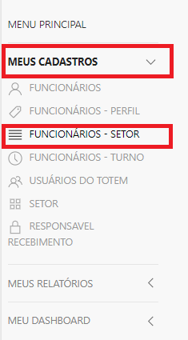
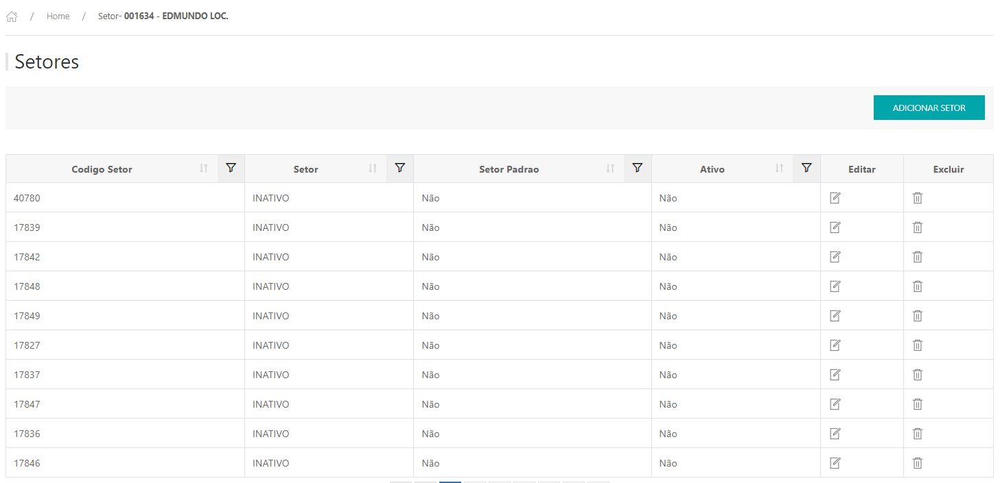
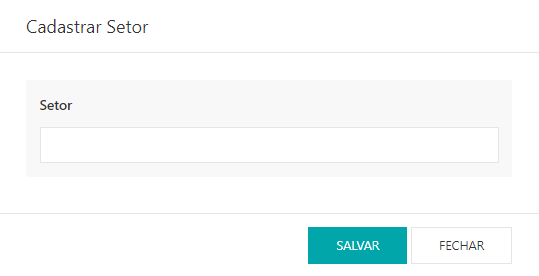

*Para realizar o cadastro de setores dos funcionários, é necessário liberar a permissão **Setores Funcionários** a partir do usuário do cliente*.

---
* Para fazer o cadastro de setores dos funcionários acesse o site pelo link, entre com o seu usuário e senha e clique em **ENTRAR**.

* Selecionar o cliente que deseja , clicar em **ACESSAR**.

Site: http://myelis.elisbrasil.com/

---

* No menu principal clicar em **MEUS CADASTROS > FUNCIONÁRIOS - SETOR;**

* Serão exibidas listagem com os setores que já estão cadastrados, para adicionar clicar em **ADICIONAR SETOR;**

* Informar o nome do setor e clicar em SALVAR

***Atualizado 28 de julho de 2023***