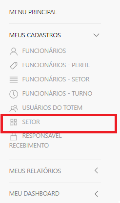
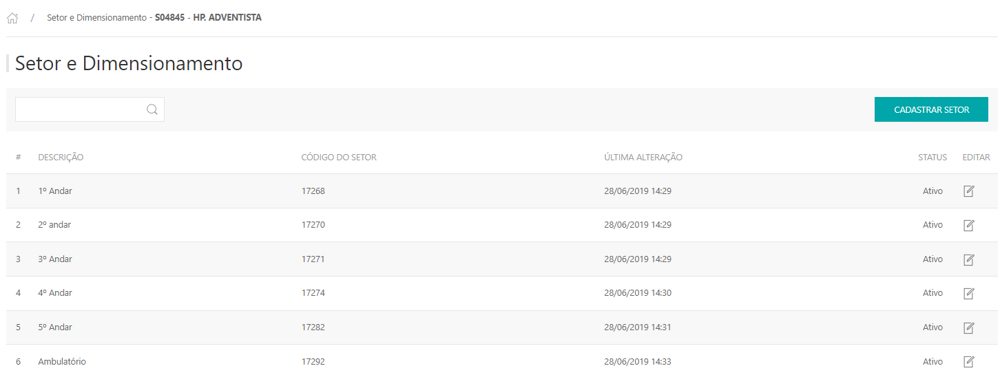
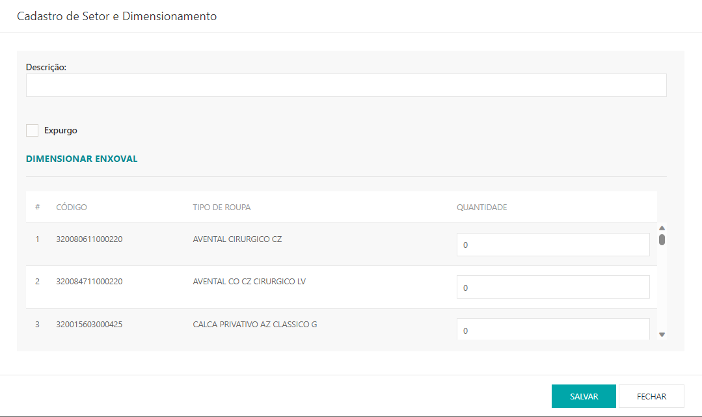
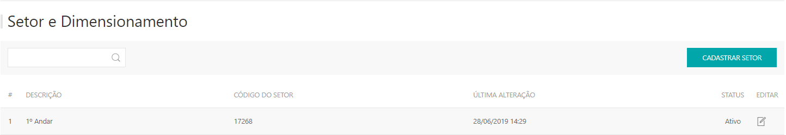
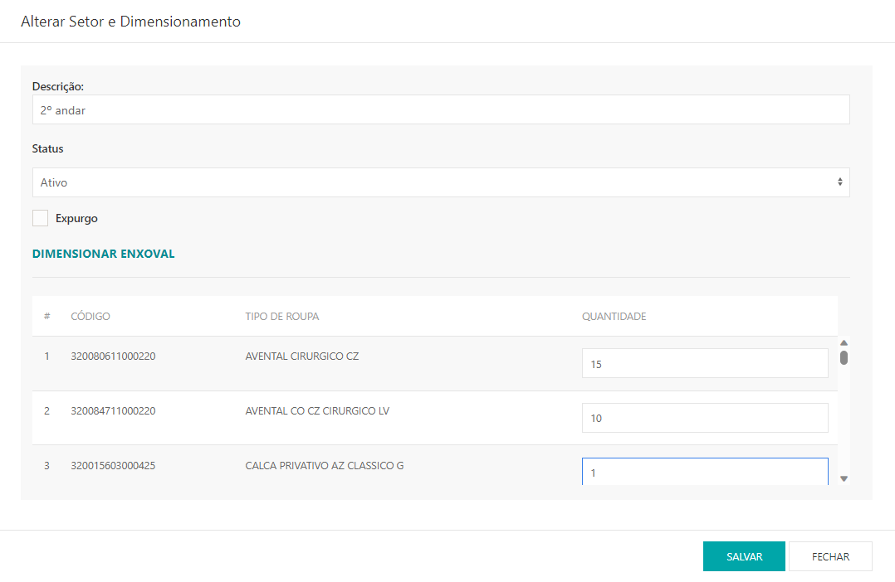
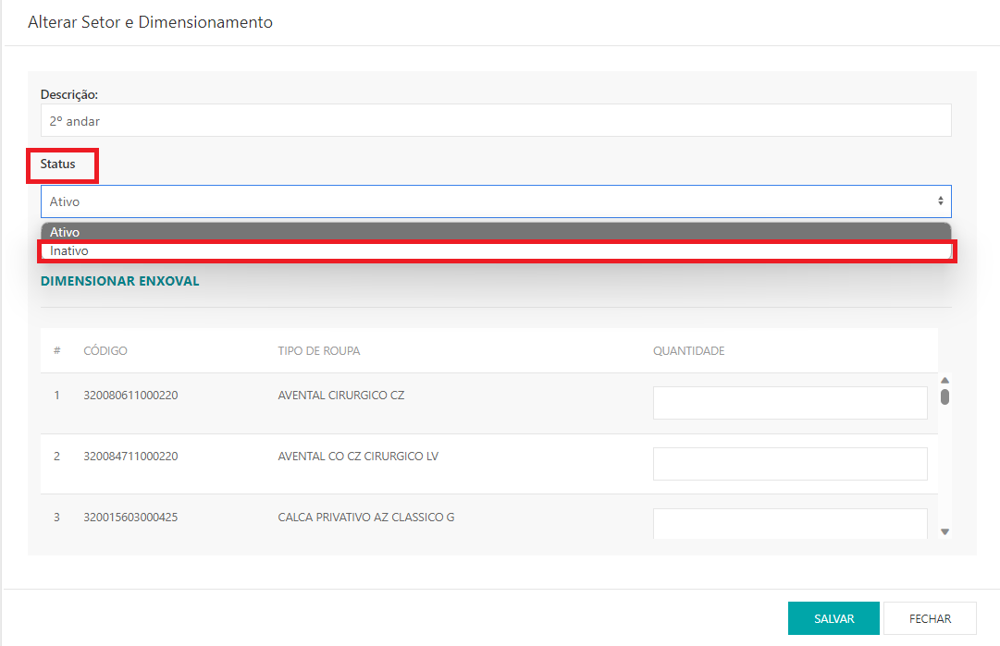

---
* **No manual de instruções abaixo, apresenta as seguintes funcionalidades.**
- *Cadastro dos setores do cliente;*
- *Dimensionamento de produtos por setor*.

* Para cadastrar os setores do cliente, liberar a permissão **Cadastro de Setor > Cliente** (usuario de colaborador aba de cliente);
* Ao entrar com o usuário do cliente, siga o caminho **MEUS CADASTROS > SETORES**

* Será exibida uma lista com todos os setores cadastrados. Para cadastrar um novo setor, clicar em **CADASTRAR SETOR** 

* Na descrição informar o nome do setor que deseja criar, se for um setor onde a leitura é feita na hora do expurgo, selecionar a opção **Expurgo**.

---

* Para cadastrar dimensionamento para o setor, clicar no setor que deseja editar;

*  Apresentará os produtos que estão associados ao cliente, informar a quantidade que deseja parametrizar do produto;

* Para inativar um setor, clicar em editar e no **status** selecionar a opção **Inativo**.

***Atualizado em 28 de julho de 2023***