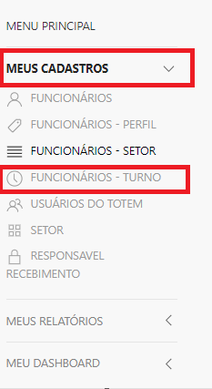
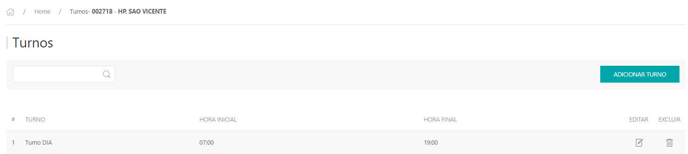
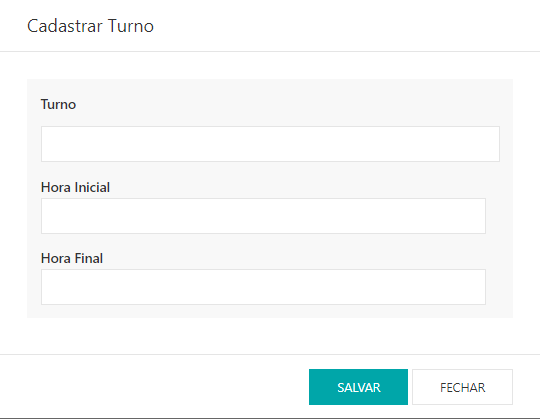

*Para realizar o cadastro de turnos dos funcionários,  é necessário liberar essa permissão, **turno-funcionário** a partir do usuário do cliente.*

---

* Para fazer o cadastro de turno acesse o site pelo link, entre com o seu usuário e senha e clique em **ENTRAR**.

* Selecionar o cliente que deseja , clicar em **ACESSAR.**

Site: http://myelis.elisbrasil.com/

---
*  No menu principal clicar em **MEUS CADASTROS > FUNCIONÁRIOS - TURNO;**

* Serão exibidas listagem com os turnos que já estão cadastrados, para adicionar clicar em **ADICIONAR TURNO;**

* Informar o turno, hora inicial e hora final, clicar em **SALVAR.**

***Atualizado em 28 de julho de 2023***