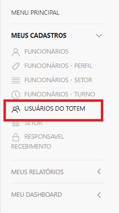
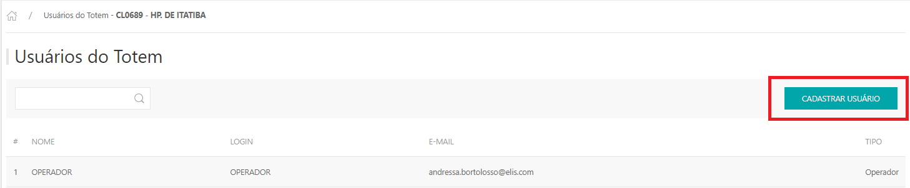
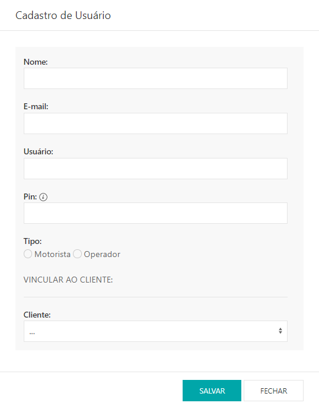

---
*Para realizar o cadastro dos usuários do TOTEM do cliente, e liberar sua permissão de usuário ao totem. Esse cadastro é para operador e motorista.*

* Para fazer o cadastro de usuários do Totem acesse o site pelo link, entre com o seu usuário e senha e clique em **ENTRAR**.

* Selecionar o cliente que deseja , clicar em **ACESSAR**;

Site: http://myelis.elisbrasil.com

---

* No menu principal clicar em **MEUS CADASTROS > USUÁRIOS DO TOTEM**;

* Serão exibidas listagem com os usuários que já estão cadastrados, para adicionar clicar em **CADASTRAR DE USUÁRIO**;

* Informar o nome de usuário, e-mail, usuário (nome que aparecerá no totem), Pin (Senha que será utilizada até 5 digitos); Tipo (Motorista/Operador), e vincular com o cliente que já vai está logado. Clicar em **SALVAR**.

***Atualizado em 28 de julho de 2023***