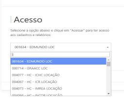
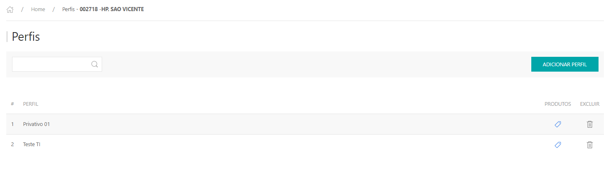
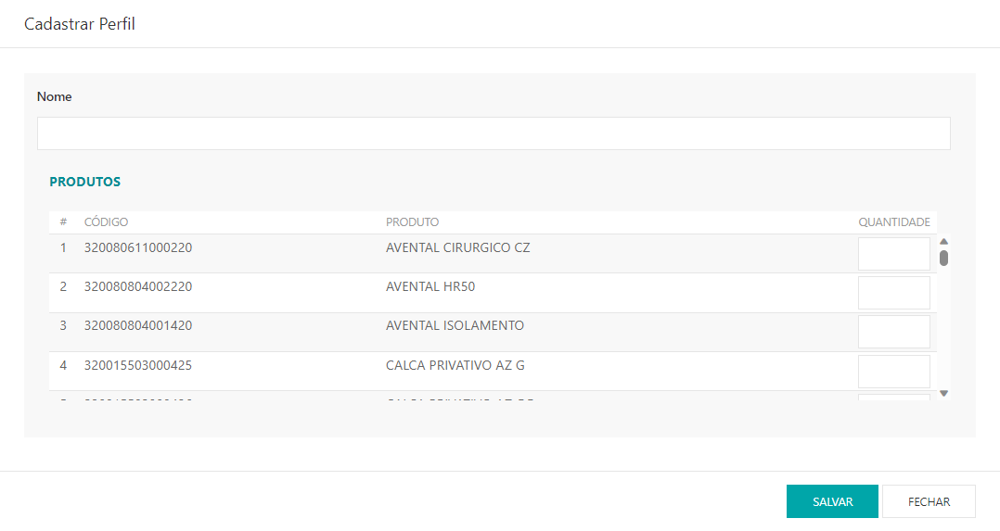

* Para fazer o cadastro de perfil dos funcionários acesse o site pelo link, entre com o seu usuário e senha de cliente e clique em **ENTRAR**.

* Selecionar o cliente que deseja , clicar em **ACESSAR**.

Site: http://myelis.elisbrasil.com/

---

* No menu principal clicar em **MEUS CADASTROS > FUNCIONÁRIOS - PERFIL**;

* Serão exibidas listagem dos perfis que já estão cadastrados, para adicionar clicar em **ADICIONAR PERFIL**;

* Informar o nome do perfil, e vincular os produtos com as quantidades correspondentes. Clicar em **SALVAR**.

***Atualizado 28 de julho de 2023***