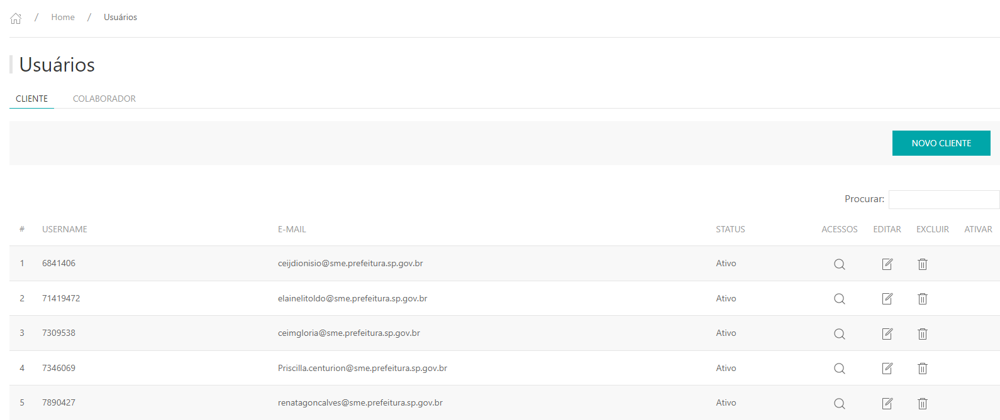
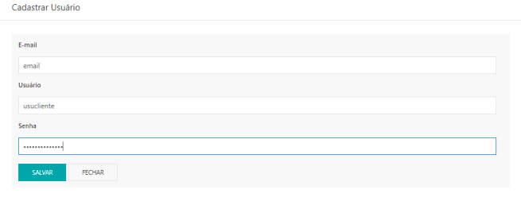
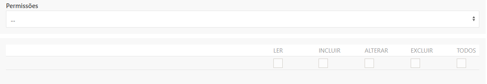
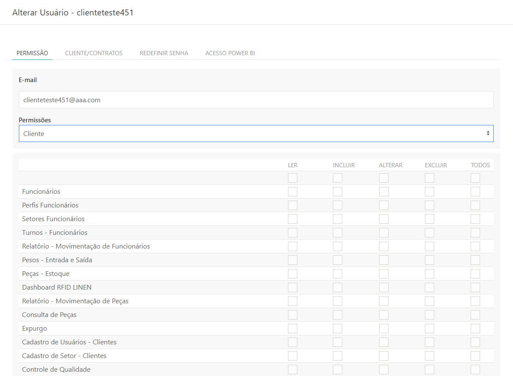
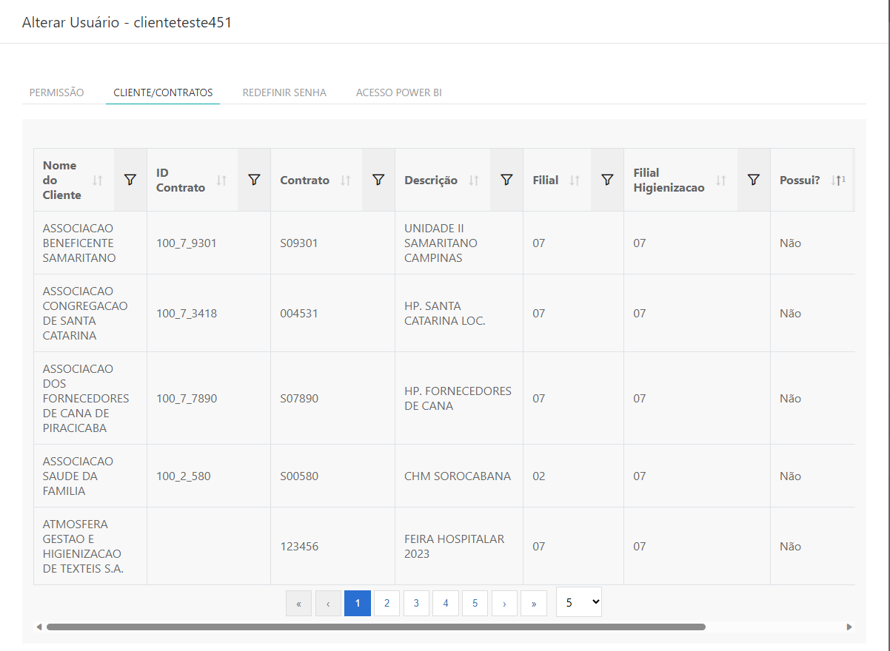
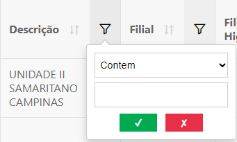
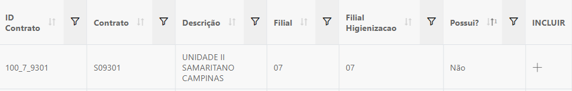
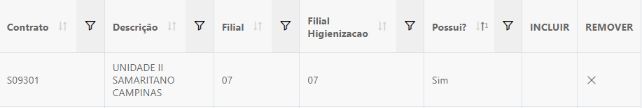

---

* Para fazer o cadastro de usuários acesse o site pelo link, entre com o seu usuário e senha de rede e clique em **ENTRAR**.

* Selecionar a filial de acesso, clicar em **ACESSAR**.

Site: http://myelis.elisbrasil.com

---

* No menu principal clicar em **CONTROLE DE ACESSO – usuários**

* Serão exibidas as listas de usuários já cadastrados atualmente;
* Para cadastrar um novo usuário do tipo cliente, clique em **NOVO CLIENTE**.

---

* Na tela de cadastro é preciso preencher todas as informações: E-mail, Usuário e Senha.
* **O e-mail não é obrigatório ser do cliente**;
* **Usuário deve ser criado manualmente**;
* **A senha deve ser composta por 8 dígitos contendo letras, números e caracteres especiais.**;
* **Ao finalizar clicar em SALVAR**;

---

* Ao salva as informações do usuário, irá apresentar a tela para liberação dosrelatórios do perfil cliente
* Clicar em **Permissão** e selecionar **Cliente**

* Selecionar os relatórios onde terão acesso, habilitar somente a coluna **LER** e clicar em **SALVAR**, e em caso de Cadastros a opção de **Incluir** e **Alterar**

---

* Após a liberação dos relatórios, liberar quais os contratos o cliente terá acesso;
* Clicar na aba **CLIENTE/CONTRATOS**, onde listará todos os contatos que pertence a filial e o segmento selecionado ao entrar no MyElis.

* É possível pesquisar pelo nome do contrato, nº do contrato (pode ser confirmado através do COALA > Histórico do Cliente)

* Para incluir um contrato clicar no ícone + na coluna incluir.

* Os contratos que estão inclusos no usuário do cliente ficara com a coluna **POSSUI** preenchido como SIM, e um X na coluna **Remover**.

* Para remover contratos do usuário clicar em X na coluna remover. É possível filtrar pela coluna possui, os contratos ativos na senha do cliente.
* A realizar ai inclusão ou remoção de contratos clicar em **FECHAR**.

***Atualizado 28 de julho de 2023***