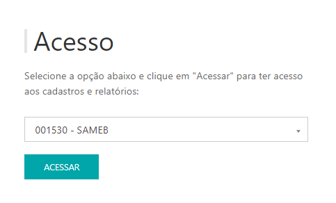

---
* Para fazer o cadastro de turno acesse o site pelo link, entre com o seu usuário e senha e clique em **ENTRAR**.

* Selecionar o cliente que deseja , clicar em **ACESSAR.**

Site: http://myelis.elisbrasil.com/

---
*  O relatório de Controle de Qualidade apresenta o total de peças que estão alocadas no cliente com as quantidades de higienizações e data da última prova de eficácia;

* É possível pesquisar por um EPC específico digitando na caixa de texto;
* Exportação: 100% das informações.

---
**O relatório apresenta as seguintes informações:**

* **Total de Peças**: Quantidades que estão alocadas no cliente;
* **Média Higienizações**: Total da soma de todas as higienizações dividido pelo total de peças;
* **Código do Produto**;
* **Produto**;
* **Número do Chip (RFID)**: Número da TAG;
* **Qtd. Higienizações**;
* **Data Prova de Eficácia**: Data do último teste realizado na peça;

**Uso**: Somente Clientes com produto de  controle de qualidade

***Atualizado 31 de julho de 2023***