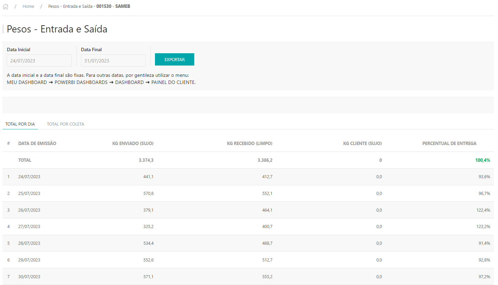
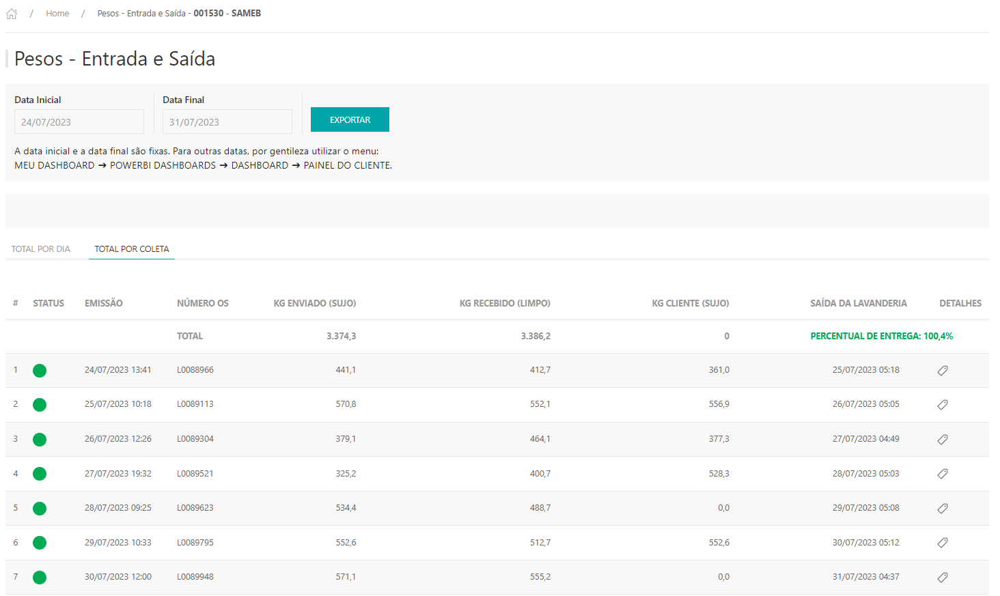
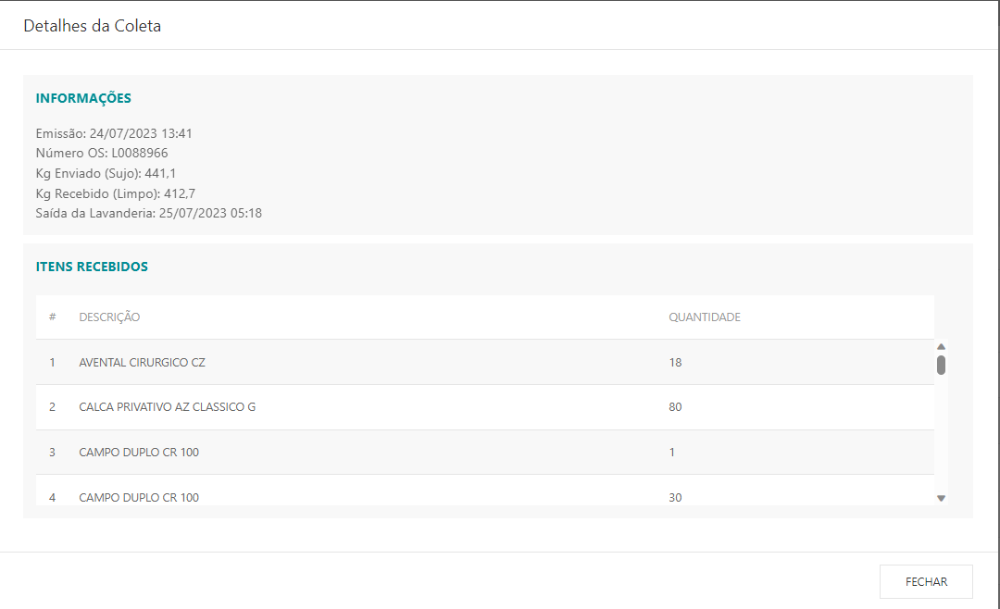

*O Relatório apresenta as informações das pesagens de entrada e saída do cliente.*

---
* Para fazer o relatório acesse o site pelo link, entre com o seu usuário e senha de cliente e clique em **ENTRAR**.

* Selecionar o cliente que deseja , clicar em **ACESSAR.**

Site: http://myelis.elisbrasil.com/

---
* Parametrizar as datas inicial e final da pesquisa de acordo com o período que deseja pesquisar (lembrando que a regra é dos últimos 60 dias) clicar em **BUSCAR;**

* Na primeira aba **TOTAL POR DIA** são listados as datas, os pesos e totais (kg enviado (sujo), kg recebido (limpo) e percentual de entrega) por dia;

* Exportação: Respeitando o filtro de data com as informações por documento.

--- 

* Na segunda aba TOTAL POR COLETA são listados as datas de emissão do documento, número da OS, os peso do kg enviado (sujo), kg recebido (limpo) e percentual de entrega do período selecionado e a data de saída do documento da lavanderia;

* Na primeira coluna mostra o Status da coletas, caso o documento já foi expedido para o cliente fica em verde, e caso o documento ainda não foi expedido fica em vermelho;

* Ao clicar na coluna DETALHES são exibidas as informações da coleta com as peças que foram expedidas no documento selecionado;

* Exportação: Respeitando o filtro de data com as informações por documento.

***Atualizado 31 de julho de 2023***