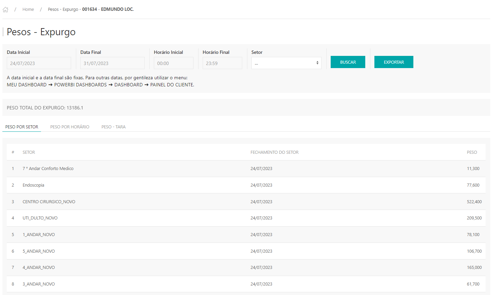
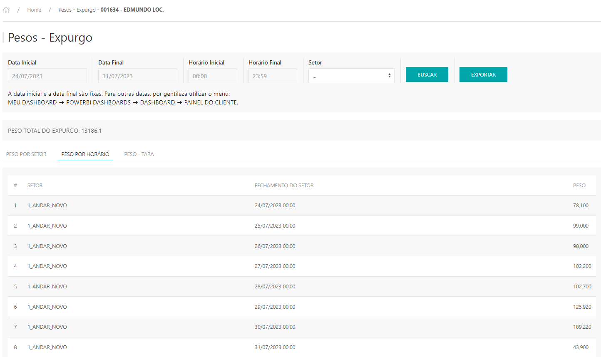
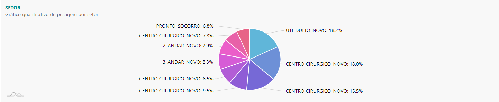
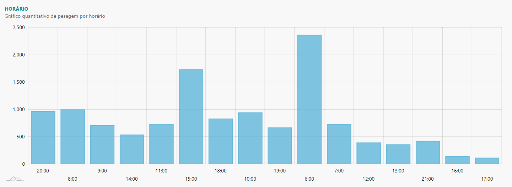
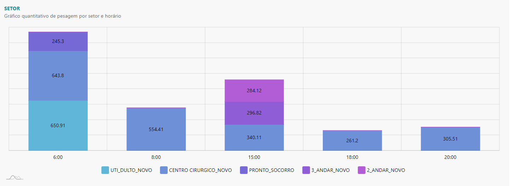
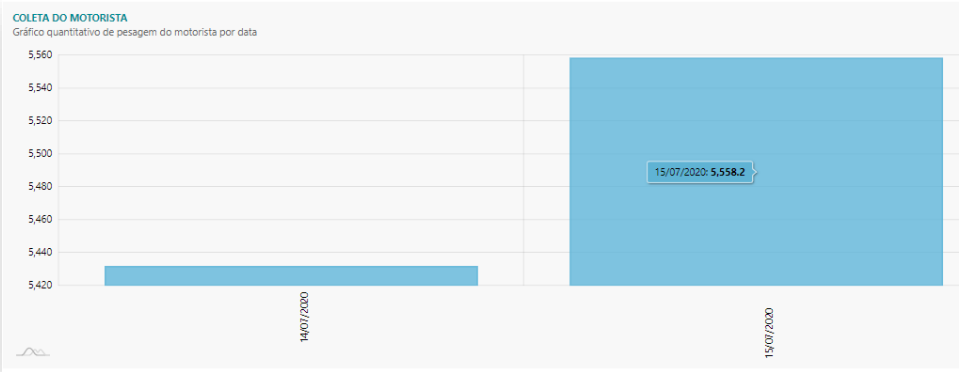

*O Relatório de expurgo, apresenta as pesagens realizadas por setor do cliente, onde exibe uma lista informando o setor, a data e o peso.*

---
* Para fazer o relatório acesse o site pelo link, entre com o seu usuário e senha de cliente e clique em **ENTRAR**.

* Selecionar o cliente que deseja , clicar em **ACESSAR.**

Site: http://myelis.elisbrasil.com/

---
* O relatório de expurgo, apresenta as pesagens realizadas por setor do cliente, onde exibe uma lista informando o setor, a data e o peso;

* Parametrizar as datas inicial e final da pesquisa de acordo com o período que deseja pesquisar (lembrando que a regra é dos últimos 60 dias) clicar em BUSCAR;

* Peso Total apresenta a quantidade de todas as pesagens realizadas no expurgo de acordo com o período pesquisado;

* Na aba **PESO POR SETOR** apresenta a pesagem agrupada por setor de acordo com o período selecionado, independe do horário;

* Na aba **PESO POR HORÁRIO**, apresenta as pesagens de acordo com o horário e data realizada;

* Na aba **PESO - TARA**, apresenta as pesagens feita nas gaiolas;

* É possivél filtrar por horário inicial e final das pesagens, como também filtar por um determinado setor;

* Exportação: Respeitando somente o filtro de datas

**Uso**: Somente Clientes com totem de pesagem

---
* São apresentados três gráficos: O primeiro gráfico apresenta o quantitativo da pesagem dos noves maiores setores;

* O segundo gráfico representa os horários que foi realizada a pesagem, e o terceiro gráfico, com as pesagens por setor (o horário é de acordo com o que o coletor confirmar do totem);

* Ao passar o mouse em cima do gráfico, apresenta o horário da pesagem e a quantidade pesada por setor.
---
* O gráfico abaixo apresenta a pesagem que o motorista finaliza no totem do cliente;

---

***Atualizado 31 de julho de 2023***