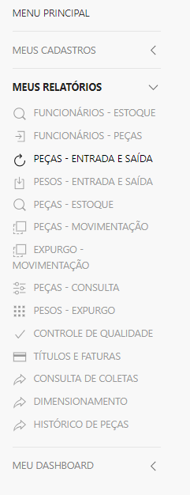
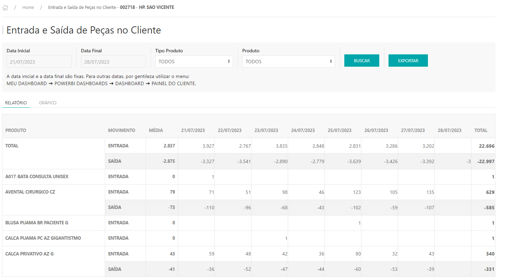
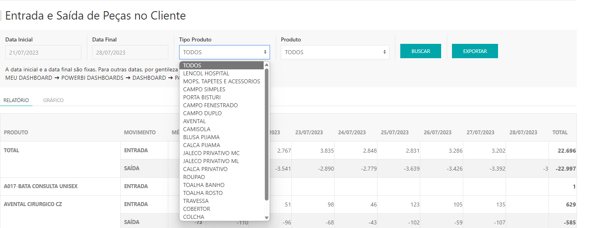

*Neste relatório é possível o cliente fazer uma análise por data e produto das peças que entrou em sua rouparia, e que foi enviado para lavanderia. Abaixo um manual detalhado.*

---

* Para fazer o cadastro de turno acesse o site pelo link, entre com o seu usuário e senha e clique em **ENTRAR**.

* Selecionar o cliente que deseja , clicar em **ACESSAR.**

Site: http://myelis.elisbrasil.com/

---

* Ao entrar com o usuário do cliente, siga o caminho **MEUS RELATÓROS > PEÇAS - ENTRADA E SAÍDA.**

* O Relatório de Entrada e Saída apresenta as quantidades de peças que saíram do cliente X as quantidades de peças que entraram no cliente, por data e produto;

* O parâmetro do relatório pode ser alterado pelo período que deseja pesquisar e/ou filtrando um tipo produto ou produto específico;

* Para atualizar o relatório clicar em **BUSCAR;**

* Exportação: 100% da movimentação de entradas e saídas, a exportação só respeita o filtro de data.

**Uso**: *Somente para clientes RFID*

***Atualizado 28 de julho de 2023***