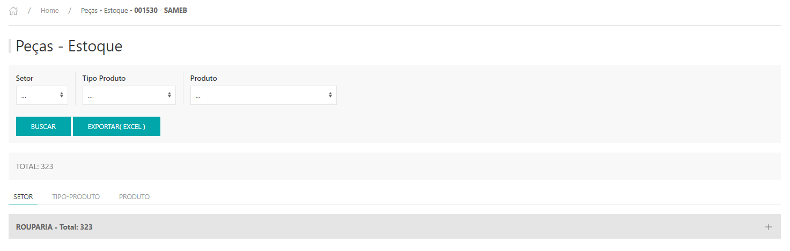
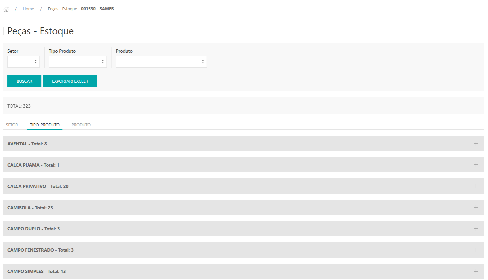
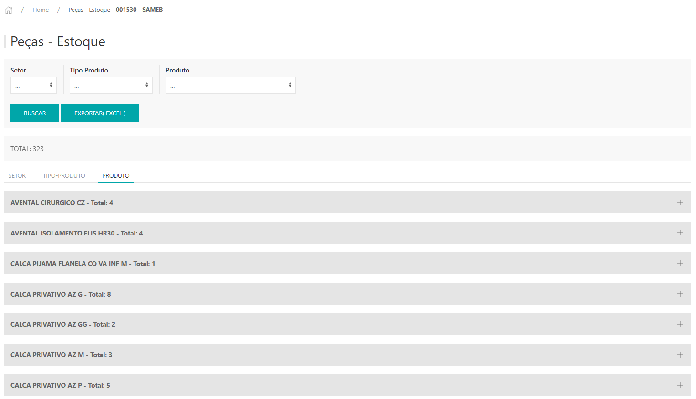
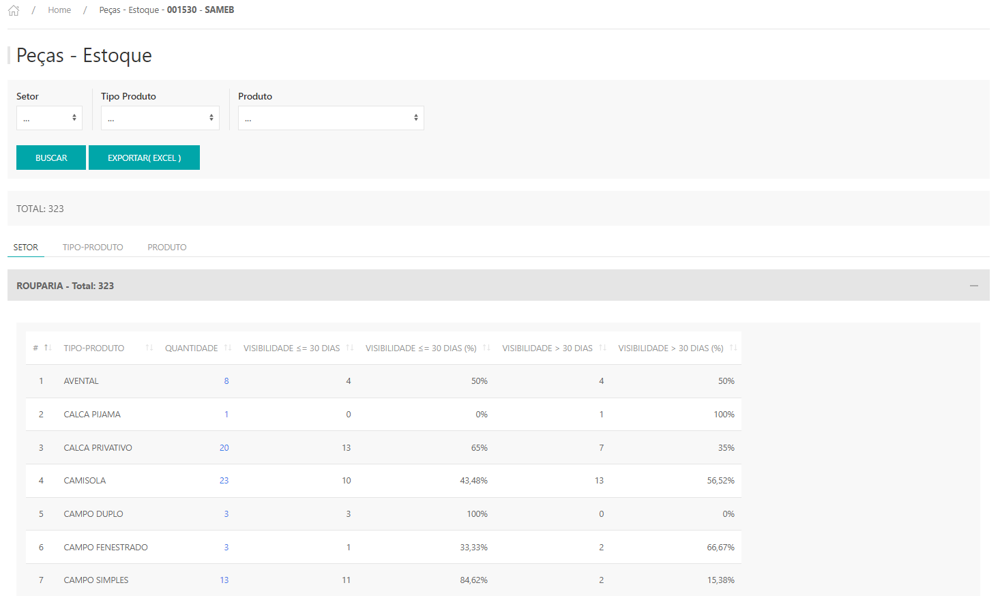
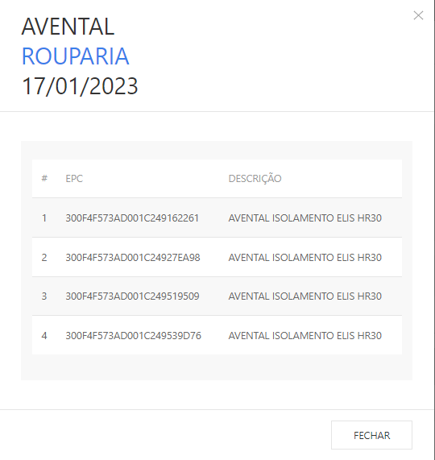
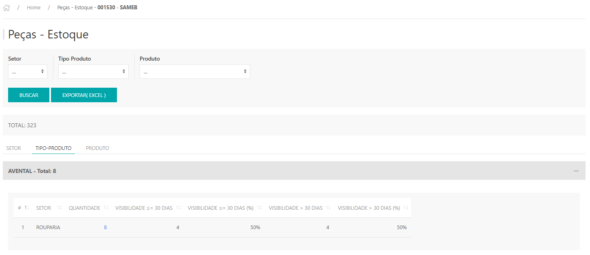
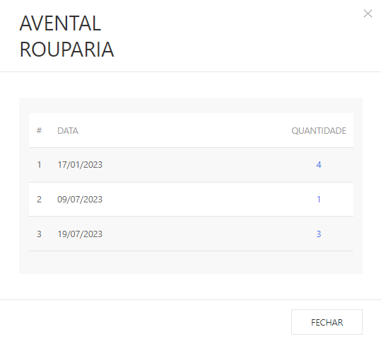
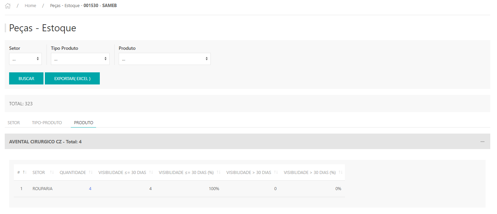
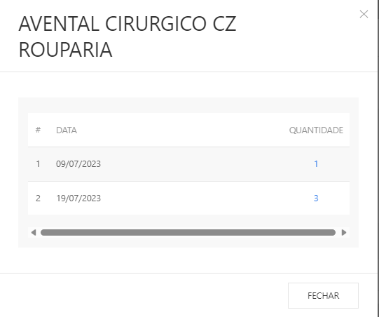
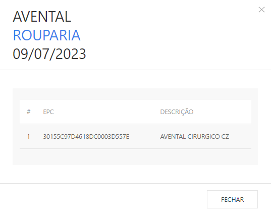

*O Relatório apresente as informação do Enxoval, com o saldo atual em cada setor, de acordo com as distribuições realizadas pelo totem.*

---
* Para fazer o relatório acesse o site pelo link, entre com o seu usuário e senha de cliente e clique em **ENTRAR**.

* Selecionar o cliente que deseja , clicar em **ACESSAR.**

Site: http://myelis.elisbrasil.com/

---
* Informação do Enxoval, com o saldo atual em cada setor, de acordo com as distribuições relizadas pelo totem;

* Ao clicar em buscar, o relatório apresenta 100% das peças que estão no hospital;

* É possivel parametrizar a pesquisa de acordo com: Setor / Tipo de Produto / Produto, que deseja rastrear. Após parametrizar, clicar em BUSCAR para que os resultados sejam exibidos;

* O relatório pode ser analisado de três formas: por setor, tipo de produto e produto;

* Exportação: 100% do Enxoval no cliente, informando inclusive a data que o foi movimentado para o Setor. É possível avaliar o tempo que a peça está “parada” no Setor, para fins de gestão de evasão ou inventário.

---
* Ao clicar no setor, a lista dos produtos relacionados será exibida abaixo juntamente com uma tabela com as quantidades e as visibilidades das peças, até 30 dias e acima de 30 dias;

* **Quantidade**: Número de peças alocadas no setor;
* **Visibilidade <= 30 dias**: Quantidade de peças visíveis no período de até 30 dias;
* **Visibilidade <= 30 dias (%)**: Visibilidade <= 30 dias dividido pela quantidade total;
* **Visibilidade > 30 dias**: Quantidade de peças que estão paradas a mais de 30 dias;
* **Visibilidade > 30 dias (%)**: Visibilidade > 30 dias dividido pela quantidade total;

* Ao clicar em cima da quantidade de um determinado produto, abrirá as quantidades distribuidas de acordo com a data, onde mostra desde quando essa peça está no setor e não se movimentou;

* Após abrir as datas de distribuição, é póssivel extrair o número do EPC da peça, clicando em cima da quantidade;

* É possível alterar as ordens dos dados, clicando no cabeçalho da coluna correspondente

---
* Ao clicar no **tipo do produto**, a lista por tipo de produtos relacionados será exibida abaixo, e ao clicar em cima de um tipo de produto, abrirá uma lista dos setores juntamente com uma tabela com as quantidades e as visibilidades das peças, até 30 dias e acima de 30 dias;

* **Quantidade**: números de peças alocadas no setor;
* **Visibilidade <= 30 dias**: Quantidaes de peças visiveis no período de até 30 dias;
* **Visibilidade <= 30 dias (%)**: Visibilidade <= 30 dias dividido pela quantidade total;
* **Visibilidade > 30 dias**: Quantidade de peças que estão paradas a mais de 30 dias;
* **Visibilidade > 30 dias (%)**: Visibilidade > 30 dias dividido pela quantidade total;

* Ao clicar em cima das quantidades de um determinado setor, abrirá as quantidades distribuidas de acordo com a data, onde mostra desde quando essa peças está no setor e não se movimentou;

* Após abrir as datas de distribuição, é póssivel extrair o número do EPC da peça, clicando em cima das quantidades;

* É possível alterar as ordens dos dados, clicando no cabeçalho da coluna correspondente.

---
* Ao clicar no **produto**, mostrará a lista com as descrições dos produtos, e ao clicar em um determinado produto serão exibido os setores abaixo juntamente com uma tabela com as quantidades e as visibilidades das peças, até 30 dias e acima de 30 dias;

* Quantidade: Número de peças alocadas no setor;
* Visibilidade <= 30 dias: Quantidade de peças visíveis no período de até 30 dias;
* Visibilidade <= 30 dias (%): Visibilidade <= 30 dias dividido pela quantidade total;
* Visibilidade > 30 dias: Quantidade de peças que estão paradas a mais de 30 dias;
* Visibilidade > 30 dias (%): Visibilidade > 30 dias dividido pela quantidade total;

* Ao clicar em cima das quantidades de um determinado setor, abrirá as quantidades distribuidas de acordo com a data, onde mostra desde quando essa peças está no setor e não se movimentou;

* Após abrir as datas de distribuição, é póssivel extrair o número do EPC da peça, clicando em cima da quantidade;

* É possível alterar as ordens dos dados, clicando no cabeçalho da coluna
correspondente.

***Atualizado 31 de julho de 2023***