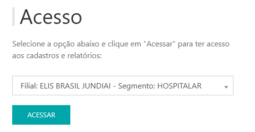
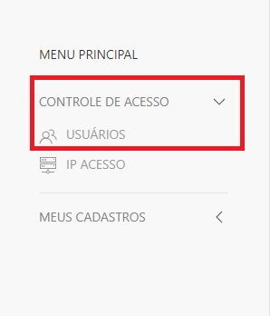
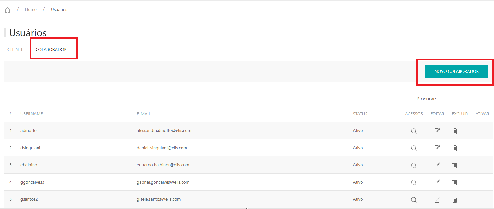

---
## Cadastro de Colaborador

* Para fazer o cadastro de usuários acesse o site pelo link, entre com o seu usuário e senha de rede e clique em **ENTRAR**.

* Selecionar a filial de acesso, clicar em **ACESSAR**.

Site: http://myelis.elisbrasil.com

---

* No menu principal clicar em **CONTROLE DE ACESSO > usuários**.

* Serão exibidas as listas de usuários já cadastrados atualmente clicar em **COLABORADOR**;
* Para cadastrar um novo usuário do tipo cliente, clique  em **NOVO CLIENTE**.

* Na aba de **Novo Colaborador** é necessario colocar somente o usuário de windows do colaborador.

* Ao salva as informações do usuário, irá apresentar a tela para liberação dos relatórios do perfil colaborador;
* Clicar em **Recurso** e selecionar **Colaborador**.

* Selecionar os relatórios onde sera necessario acesso, habilitar somente a coluna **LER** e clicar em **SALVAR**, e em caso de Cadastros a opção de **INLCUIR E ALTERAR.**

---

## Contratos

* Após a liberação dos relatórios, liberar quais os contratos o colaborador terá acesso;
* Clicar na aba FILIAL - SEGMENTO, onde listará todas as filiais e o segmento selecionado ao entrar no MyElis;
* Selecionar a filial necessesaria e o segmento e clicar em **INCLUIR**.

***Atualizado 28 de julho de 2023***