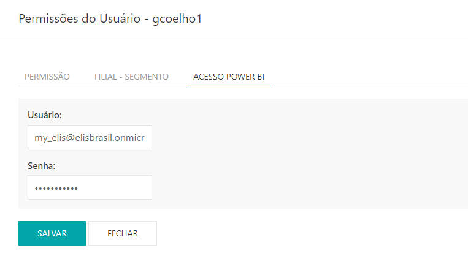

---

## Liberar Acesso

* Para liberar o acesso ao Power BI acesse o site pelo link, entre com o seu usuário e senha de rede e clique em entrar.
* Selecionar a filial de acesso, clicar em **ACESSAR**.

site: http://myelis.elisbrasil.com/

---

* No menu principal clicar em **CONTROLE DE ACESSO > USUÁRIOS**
* Serão exibidas as listas de usuários já cadastrados atualmente

* Para liberar o acesso, clique na aba **COLABORADOR**.

* Se o usuário já estiver na lista, clique no botão **Editar**  , caso contrário clique em **NOVO COLABORADOR** e após o cadastro informando o usuário de rede, clique em **Editar**
* Na aba **PERMISSÃO**, marcar a opção de leitura (**LER**) nos relatórios do PowerBI BI e clique em **SALVAR**

* Na aba **FILIAL – SEGMENTO**, incluir as filiais de acesso ao usuário BI e clique em **SALVAR**

* Na aba **ACESSO POWER BI**, incluir o usuário e senha de acesso ao Power BI e clique em **SALVAR**.

***Atualizado 26 de Julho de 2023***