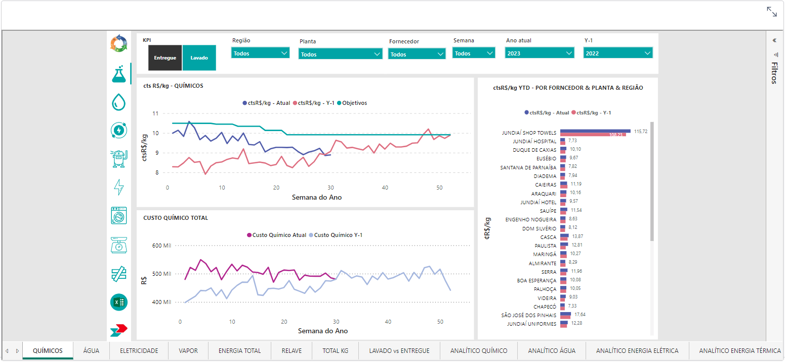
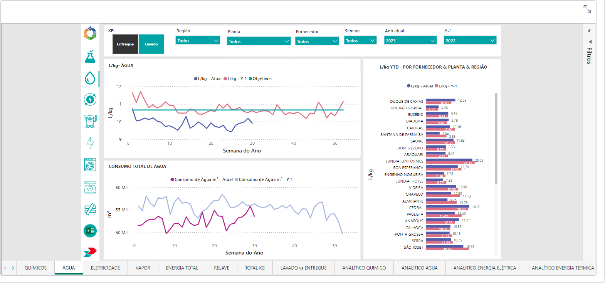
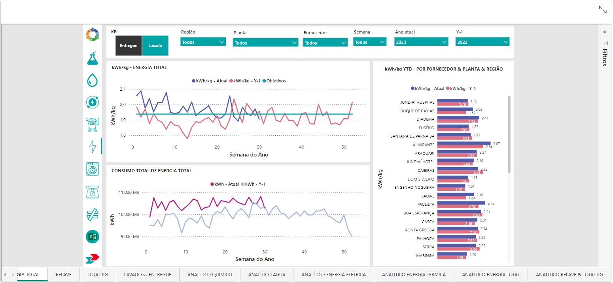
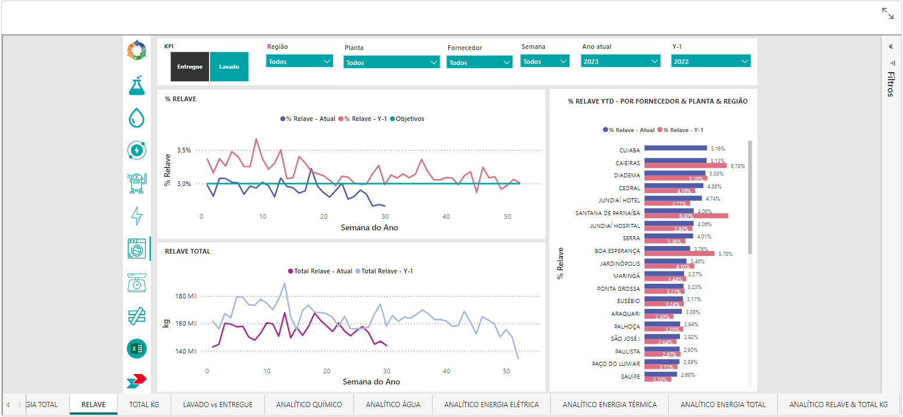
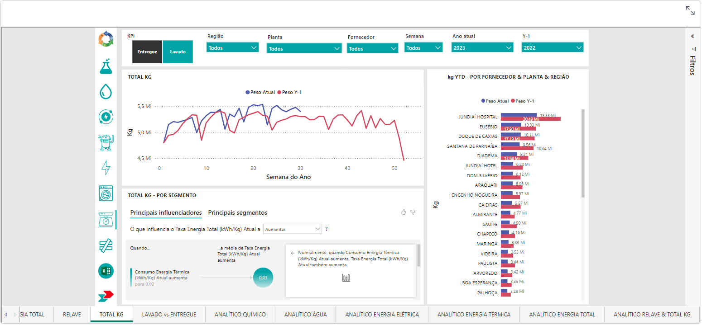
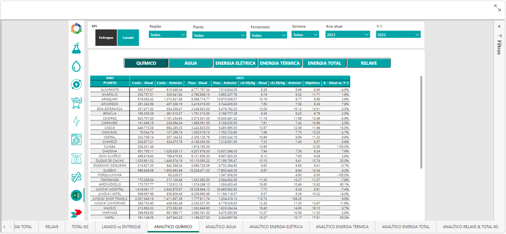
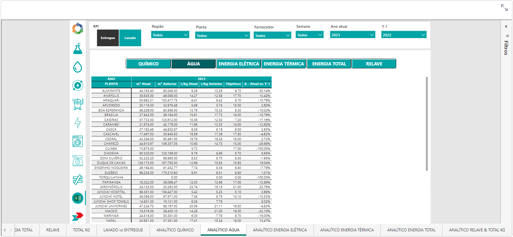
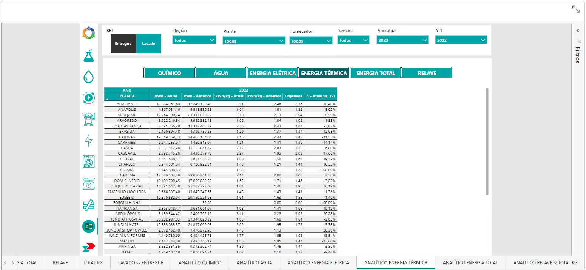
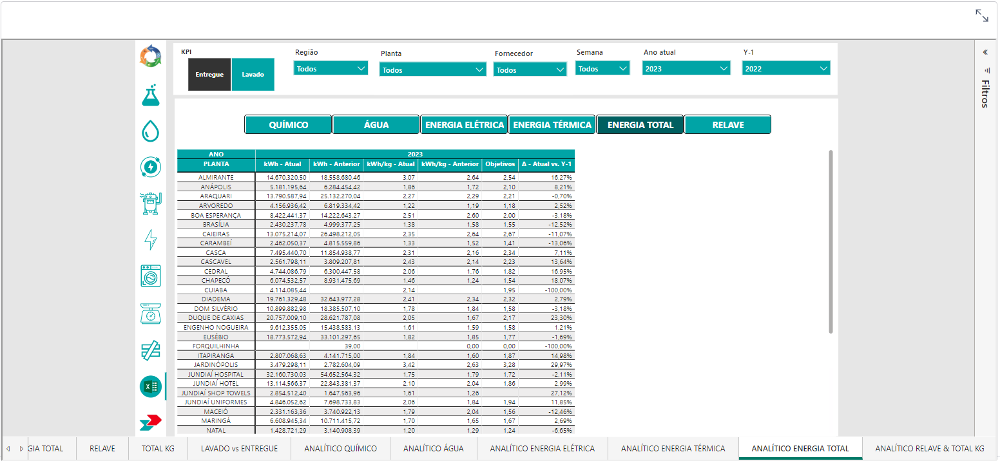
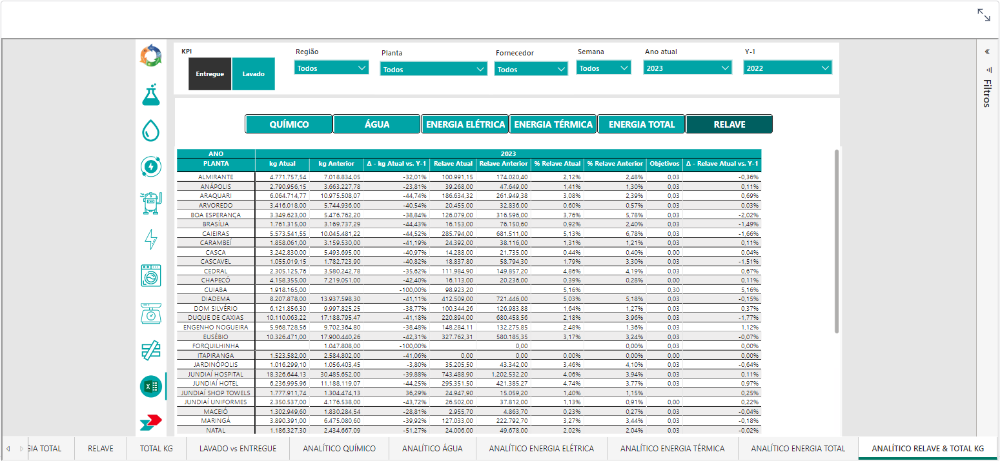

### Permissão Vinculada

- **TCL**
---
## Químicos

## Água

## Eletricidade 

## Vapor

## Energia Total

## Relave

## Total KG

## Lavado vs Entregue

## Analítico Químico

## Analítico Água

## Analítico Energia Elétrica

## Analítico Energia Térmica

## Analítico Energia Total

## Analítico Relave & Total KG

